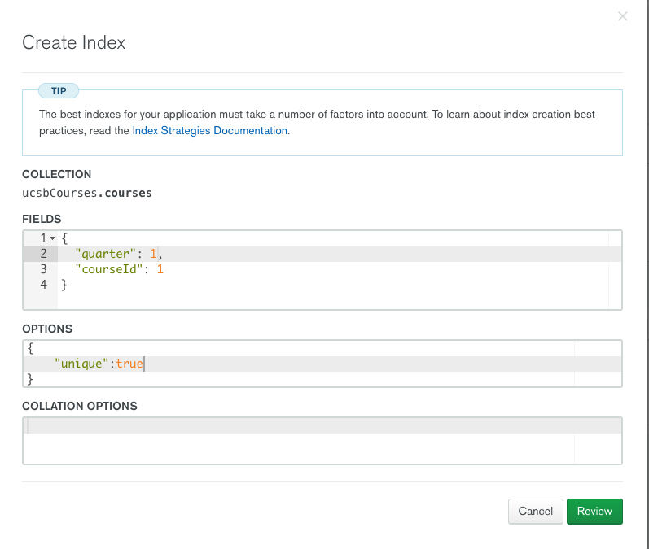

# ucsb-courses-search-support-scripts

Support Scripts for ucsb-courses-search

# env.sh script

You need to:
* copy from `env.sh.SAMPLE` to `env.sh` (which is in the `.gitignore`)
* put appropriate values into `env.sh` for the UCSB_API_KEY and the Mongo DB username and password
* do `source env.sh` before running `python grabAndUpdate.py` (could be `python3 grabAndUpdate.py on
  some systems, including CSIL and many MacOS systems.)

# Creating the index for the MongoDB collection

To ensure that course are not duplicated, you need to create the index properly.

Here's a picture:



# Creating the text index

Also create a text index like this:

```json
{
  "classSections.instructors.instructor" : "text",
  "title" : "text",
  "description" : "text"
}
```
